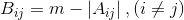
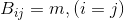

# Introduction to Paraller Programming - Project #2

This is the second project for the Introduction to Paraller Programming class of the Information and Computers Engineering curriculum at the University of West Attica.

The class is about, well, parallel programming using MPI.

The project's tasks are as follows:

- [x] Read a square matrix from the user.
- [x] Check if it is [strictly diagonally dominant](https://en.wikipedia.org/wiki/Diagonally_dominant_matrix) and print a message to the screen.

If it is:

- [x] Find the maximum element of the diagonal and print it to the screen.
- [x] Calculate and print a matrix based on the following formulas:

  

  

where `m` is the previously calculated maximum element of the diagonal and `A` the original matrix.

- [x] Find the minimum element of the new matrix and print it to the screen with it's position in the matrix.

The project has to be implemented using MPI's Collective Communication methods.

## Compilation
To compile the program simply run:
`make`

## Execution
To execute the program with a sample test file run:
`mpiexec -n 4 ./bin/main testfile.in` or
`make demo`

## Testing
The code can be tested with different inputs by changing the contents of the `testfile.in` file.

## Unit Testing
Some unit tests were implemented to speed up the debugging process (using the Catch2 library). These can be compiled and executed with the following command:
`make test`

## Documentation
The source code's documentation can be found on the `docs` directory. It was automatically generated using Doxygen and is available in both PDF and HTML format.