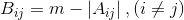
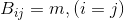

# Introduction to Paraller Programming - Project #2

This is the second project for the Introduction to Paraller Programming class of the Information and Computers Engineering curriculum at the University of West Attica.

The class is about, well, parallel programming using MPI.

The project's tasks are as follows:

- [x] Read a square matrix from the user.
- [ ] Check if it is [strictly diagonally dominant](https://en.wikipedia.org/wiki/Diagonally_dominant_matrix) and print a message to the screen.

If it is:

- [ ] Find the maximum element of the diagonal and print it to the screen.
- [ ] Calculate and print a matrix based on the following formulas:

  

  

where `m` is the previously calculated maximum element of the diagonal and `A` the original matrix.

- [ ] Find the minimum element of the new matrix and print it to the screen with it's position in the matrix.

The project has to be implemented using MPI's Collective Communication methods.